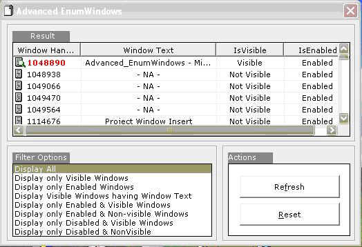

## Advanced EnumWindows

### Description

This is a fantastic demo of many useful EnumWindows and related APIs. Actually I searched for something similar on PSC , but couldn't find it. So , I can say that it's for the FIRST TIME ON PSC , a this kind of Program has been posted. There are many EnumWindows demos on PSC , but no where near to this one ! It allows you to filter the EnumWindows result based on 8 different filtering options ! Easy to Understand and complete functionality encapsulated in .mod file , hence easy to incorporate into your existing projects. I found this vry useful in many of my on going projects ... hope you feel it useful for your projects as well. PLEASE VOTE IF YOU LIKE IT	OR EVEN YOU DON'T LIKE as you can always vote "Poor" if you don't like the code ! ... BUT PLEASE PLEASE VOTE ... Constructive criticism is welcome ... please leave comments ... those will help me to improve my programming skills. I thank AllAPI.net team for developing a great API reference without which it was hardly possible for me to learn stuff like this on my own and then write a Test Application.
 
### More Info
 

             |
---                |---
**Submitted On**   |2004-01-10 04:10:02
**By**             |[Ruturaaj](https://github.com/Planet-Source-Code/PSCIndex/blob/master/ByAuthor/ruturaaj.md)
**Level**          |Intermediate
**User Rating**    |4.9 (74 globes from 15 users)
**Compatibility**  |VB 5\.0, VB 6\.0
**Category**       |[Windows API Call/ Explanation](https://github.com/Planet-Source-Code/PSCIndex/blob/master/ByCategory/windows-api-call-explanation__1-39.md)
**World**          |[Visual Basic](https://github.com/Planet-Source-Code/PSCIndex/blob/master/ByWorld/visual-basic.md)
**Archive File**   |[Advanced\_E1692391102004\.zip](https://github.com/Planet-Source-Code/ruturaaj-advanced-enumwindows__1-50895/archive/master.zip)

